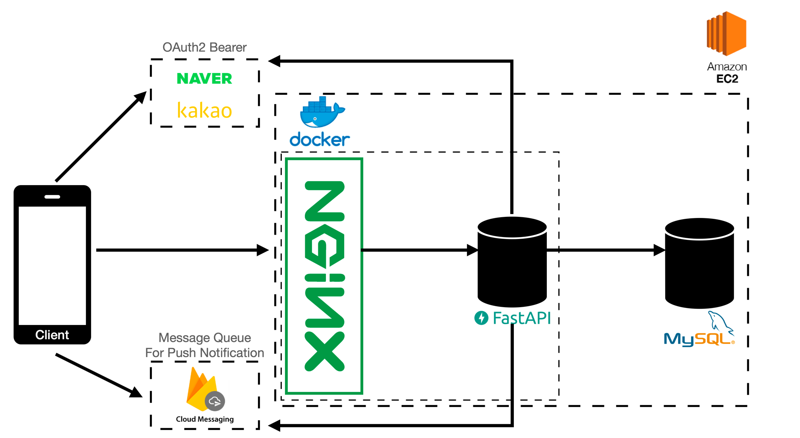

# 따끔 - 백신후기 프로젝트 : 백앤드 
## 프로젝트 개요
- COVID-19 등 감염병을 예방하기 위한 각종 백신에 대한 후기를 모아보고, 기록할 수 있는 서비스

## 프로젝트 구조 (백앤드)
### 개괄
### 상세
- EC2 인스턴스 내에 로컬 Database를 설치하여 사용합니다.
- EC2 인슽턴스 내에 도커 컨테이너로 nginx 서버를 통해 API를 서빙합니다. (FastAPI 접근 포트는 노출하지 않음)
- 컨테이너 내에서 FastAPI 서버는 8080 포트를 통해 타 서비스(nginx)와 통신합니다.
- nginx는 호스트를 통해 오는 80번 요청을 컨테이너 내 8080포트(FastAPI)로 포워딩 합니다. 
- 상세한 서버 설정은 `./nginx/nginx.conf` 참고
### Infra Structure
- Framework: [FastAPI](https://fastapi.tiangolo.com/)
- Database: [MySQL](https://www.mysql.com/)
- Web Server: [nginx](https://www.nginx.com/)
- OAuth2.0 Bearer:
  - [KAKAO](https://developers.kakao.com/product/kakaoLogin)
  - [Naver](https://developers.naver.com/docs/login/devguide/devguide.md)
- Push Notification: [FCM](https://firebase.google.com/docs/cloud-messaging?hl=ko)
- Cloud: [AWS EC2](https://aws.amazon.com/ko/free/?trk=ps_a134p000003yHYmAAM&trkCampaign=acq_paid_search_brand&sc_channel=PS&sc_campaign=acquisition_KR&sc_publisher=Google&sc_category=Core-Main&sc_country=KR&sc_geo=APAC&sc_outcome=acq&sc_detail=aws&sc_content=Brand_Core_aws_e&sc_segment=444218215904&sc_medium=ACQ-P|PS-GO|Brand|Desktop|SU|Core-Main|Core|KR|EN|Text&s_kwcid=AL!4422!3!444218215904!e!!g!!aws&ef_id=Cj0KCQjw18WKBhCUARIsAFiW7JwlD9ywb9q964x1oMhkEvLjDD1SYlwD8DJcqTMQvMKCdRNHGXbP_q0aAtTEEALw_wcB:G:s&s_kwcid=AL!4422!3!444218215904!e!!g!!aws&all-free-tier.sort-by=item.additionalFields.SortRank&all-free-tier.sort-order=asc&awsf.Free%20Tier%20Types=*all&awsf.Free%20Tier%20Categories=*all)
  - 프리티어(t2.micro - ubuntu20.04)
- ORM: 
  - [SQLAlchemy](https://docs.sqlalchemy.org/en/14/)
  - [Alembic](https://alembic.sqlalchemy.org/en/latest/) // TODO


## Deploy
### Database 스키마 생성
```shell
python3 app/db/init_db.py
```
* `env`폴더 내 `local.env` 파일에 지정된 MySQL 데이터베이스 경로에 스키마를 생성합니다.

### dev 환경 배포
```bash
docker-compose -f docker-compose-dev.yml
```

### prod 환경 배포
#### TODO


## Test over REST API
```bash
curl http://3.34.44.39
>>> "hello"%
```
- 현재 EC2 방화벽 개인 IP만 열어둠 


## TODO
#### 1. 데이터 모델링 마무리
#### 2. API 명세 작성
#### 3. alembic 셋팅
#### 4. 코딩
#### 5. 배포 스크립트를 짜던지 환경변수로 개발/실사용 환경 쉽  구분할수 있게 만들기